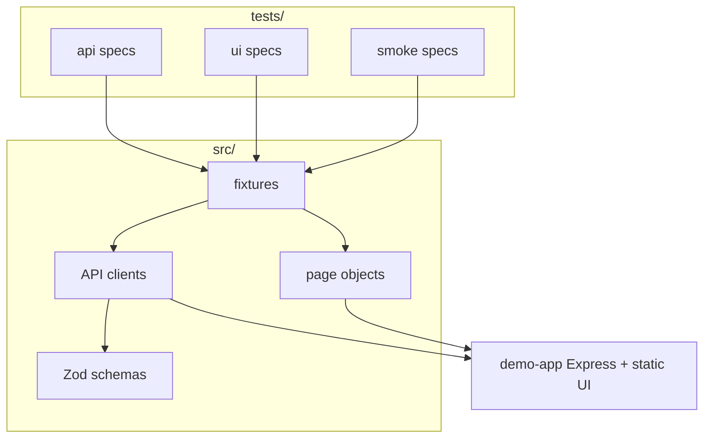

# E2E Architecture Lab

Public reference project for **SDET / test architecture** interviews: a **self-contained demo app** (Express API + minimal UI) plus a **layered Playwright** solution—**API contracts**, **page objects**, **fixtures**, **tiered projects**, and **GitHub Actions CI**.

> **Not** a production product. It is a **small, honest sandbox** you can fork, extend, and talk about in interviews.

## What this demonstrates

| Area                     | Implementation                                                                    |
| ------------------------ | --------------------------------------------------------------------------------- |
| **Test pyramid / tiers** | Separate Playwright projects: `api`, `ui`, `smoke`                                |
| **Contracts**            | [Zod](https://zod.dev) schemas on API responses                                   |
| **Clients**              | Thin `AuthApi` / `TodoApi` on a shared `BaseApiClient`                            |
| **Fixtures**             | Composed `test` with `todoApi`, `todoPage`, auto `_cleanup`                       |
| **Isolation**            | In-memory store + test-only `POST /api/__reset` (enabled via `DEMO_ENABLE_RESET`) |
| **CI**                   | Lint, format check, Playwright on Chromium                                        |

## Architecture



## Prerequisites

- **Node.js 20+**
- **npm**

## Quick start

```bash
npm install
npx playwright install chromium
npm test
```

- Starts the **demo app** automatically (see `playwright.config.ts` → `webServer`).
- HTML report: `npm run test:report`

### Scripts

| Script                                  | Purpose                                                                       |
| --------------------------------------- | ----------------------------------------------------------------------------- |
| `npm run demo:start`                    | Run demo server only (default [http://127.0.0.1:3000](http://127.0.0.1:3000)) |
| `npm test`                              | All Playwright projects                                                       |
| `npm run test:api`                      | API tests only                                                                |
| `npm run test:ui`                       | UI tests (Chromium)                                                           |
| `npm run test:smoke`                    | Cross-stack smoke                                                             |
| `npm run lint` / `npm run format:check` | Static quality                                                                |

## Demo credentials

- User: `demo` / Password: `demo123`
- Override with env vars: `DEMO_USER`, `DEMO_PASS` (see `.env.example`).

## Interview talking points

1. **Why API + UI?** Fast, stable checks at the HTTP layer; UI for rendering and user flows; smoke for **thin** cross-stack confidence.
2. **Why reset endpoint?** Parallel-safe **deterministic** data without a full database; gated by env so it is never a surprise in “fake prod.”
3. **Why Zod?** Fail fast on **response drift** instead of chasing `undefined` deep in tests.
4. **What would you add next?** (Good answer fodder) OpenAPI sync, k6 load smoke, visual regression policy, container image for the demo app, mutation testing, etc.

## License

MIT — see [LICENSE](./LICENSE).

## Suggested GitHub repo setup

1. Create a new **public** repository on your account (e.g. `e2e-architecture-lab`).
2. From this folder:

   ```bash
   git init
   git add .
   git commit -m "chore: initial SDET reference framework"
   git branch -M main
   git remote add origin git@github.com:<you>/e2e-architecture-lab.git
   git push -u origin main
   ```

3. Enable **GitHub Actions** (default for public repos).

Replace `<you>` with your GitHub username and adjust the repo name if you prefer.
