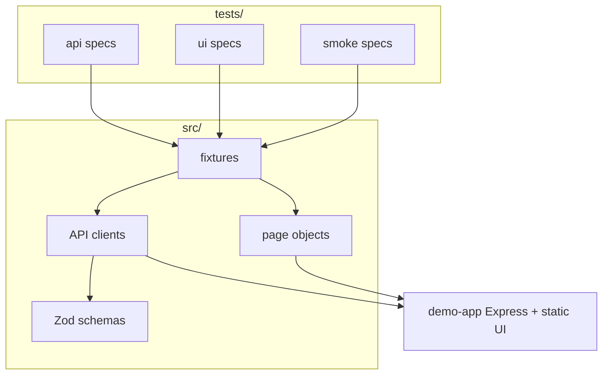

# E2E Architecture Lab

A **self-contained demo app** (Express API + minimal UI) plus a **layered Playwright** solution—**API contracts**, **page objects**, **fixtures**, **tiered projects**, and **GitHub Actions CI**.

> **Not** a production product. It is a **small, honest sandbox** you can fork, extend.

## What this demonstrates

| Area                     | Implementation                                                                    |
| ------------------------ | --------------------------------------------------------------------------------- |
| **Test pyramid / tiers** | Separate Playwright projects: `api`, `ui`, `smoke`                                |
| **Contracts**            | [Zod](https://zod.dev) schemas on API responses                                   |
| **Clients**              | Thin `AuthApi` / `TodoApi` on a shared `BaseApiClient`                            |
| **Fixtures**             | Composed `test` with `todoApi`, `todoPage`, auto `_cleanup`                       |
| **Isolation**            | In-memory store + test-only `POST /api/__reset` (enabled via `DEMO_ENABLE_RESET`) |
| **CI**                   | Lint, format check, Playwright on Chromium                                        |

## Architecture



## Prerequisites

- **Node.js 20+**
- **npm**

## Quick start

```bash
npm install
npx playwright install chromium
npm test
```

- Starts the **demo app** automatically (see `playwright.config.ts` → `webServer`).
- HTML report: `npm run test:report`

### Scripts

| Script                                  | Purpose                                                                       |
| --------------------------------------- | ----------------------------------------------------------------------------- |
| `npm run demo:start`                    | Run demo server only (default [http://127.0.0.1:3000](http://127.0.0.1:3000)) |
| `npm test`                              | All Playwright projects                                                       |
| `npm run test:api`                      | API tests only                                                                |
| `npm run test:ui`                       | UI tests (Chromium)                                                           |
| `npm run test:smoke`                    | Cross-stack smoke                                                             |
| `npm run lint` / `npm run format:check` | Static quality                                                                |

## Demo credentials

- User: `demo` / Password: `demo123`
- Override with env vars: `DEMO_USER`, `DEMO_PASS` (see `.env.example`).
